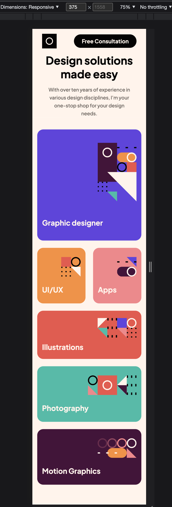
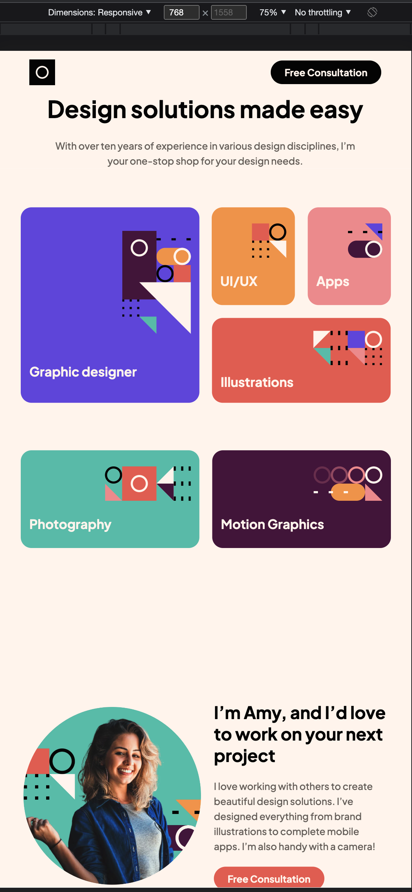
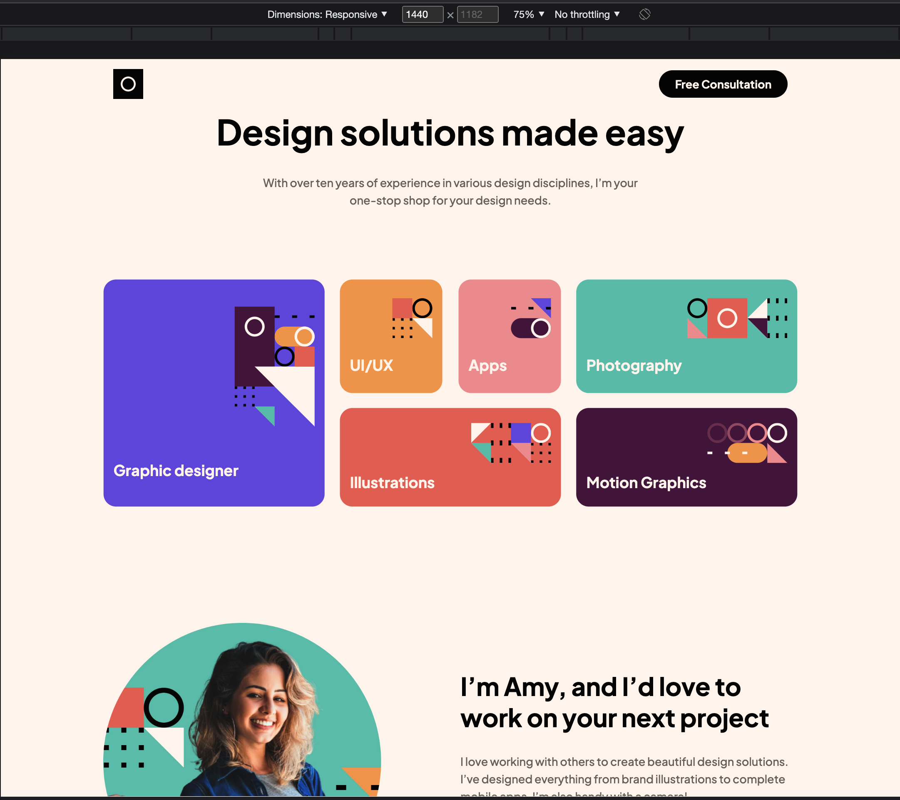

# Frontend Mentor - Single-page design portfolio solution

This is a solution to the [Single-page design portfolio challenge on Frontend Mentor](https://www.frontendmentor.io/challenges/singlepage-design-portfolio-2MMhyhfKVo). Frontend Mentor challenges help you improve your coding skills by building realistic projects.

## Table of contents

- [Overview](#overview)
  - [The challenge](#the-challenge)
  - [Screenshot](#screenshot)
  - [Links](#links)
- [My process](#my-process)
  - [Built with](#built-with)
  - [What I learned](#what-i-learned)
  - [Continued development](#continued-development)
  - [Useful resources](#useful-resources)
- [Author](#author)
- [Acknowledgments](#acknowledgments)

## Overview

### The challenge

Users should be able to:

- View the optimal layout for the site depending on their device's screen size
- See hover states for all interactive elements on the page
- Navigate the slider using either their mouse/trackpad or keyboard

### Screenshot

Add a screenshot of your solution. The easiest way to do this is to use Firefox to view your project, right-click the page and select "Take a Screenshot". You can choose either a full-height screenshot or a cropped one based on how long the page is. If it's very long, it might be best to crop it.

Alternatively, you can use a tool like [FireShot](https://getfireshot.com/) to take the screenshot. FireShot has a free option, so you don't need to purchase it.

Then crop/optimize/edit your image however you like, add it to your project, and update the file path in the image above.

**Note: Delete this note and the paragraphs above when you add your screenshot. If you prefer not to add a screenshot, feel free to remove this entire section.**

### Links

- Solution URL: [Add solution URL here](https://your-solution-url.com)
- Live Site URL: [Add live site URL here](https://your-live-site-url.com)

## My process

### Built with

- Semantic HTML5 markup
- CSS custom properties
- Flexbox
- CSS Grid
- Mobile-first workflow
- [React](https://reactjs.org/) - JS library
- [Framer-motion](https://www.framer.com/motion/) - Smooth transitions and animations.
- [Styled Components](https://styled-components.com/) - For styles
- [ViteJs](https://styled-components.com/) - A very fast dev tool to launch light project.

### What I learned

- Got more acquitted with styled-components.
- Animation and transitions with Framer motion.

### Continued development

- As I further my skills with react, I am happy with my continuous development with it and on the way learning more about react library styled components, Frame-motion.

### Useful resources

- [Stack Overflow](https://stackoverflow.com/) - Every developer's friend.
- [Google](https://www.google.com) - This is always a life a saver.
- [Styled Components](https://styled-components.com/) - Game changer in styling react components.
- [Frame-motion](https://www.framer.com/motion/) - for smooth transitions animations.
- [Vite](https://vitejs.dev/) - Is literally the next generation frontend tooling.

## Author

- Website - [hcmwebs](https://www.hcmwebs.com)
- Frontend Mentor - [@hcmwebs](https://www.frontendmentor.io/profile/Hcmwebs)
- Twitter - [@hcmwebs](https://www.twitter.com/hcmwebs)

## Acknowledgments

- [Frontend-mentor](https://www.frontendmentor.io/) - Thank you very much for creating this platform.
- [john_smilga](https://github.com/john-smilga) - Thank you very much for creating and teaching Js and React courses. I am always learning a lot from your content.
